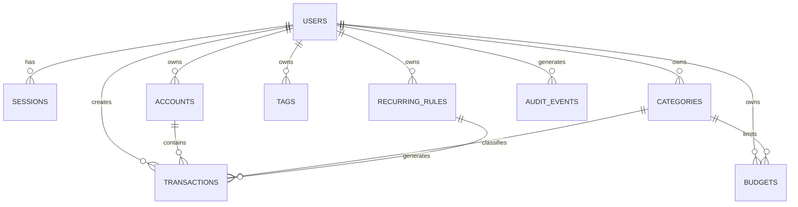

# 03 Database Schema

## Design Principles

- PostgreSQL as primary database.
- All user-owned data must include `user_id`.
- Use UUID primary keys.
- Use `numeric(18, 4)` or equivalent decimal for money.
- Use soft delete for financial records.
- Use indexes for common filters.
- Keep bank sync mapping separate from local ledger.
- Prepare for multi-currency from day one.

## Core Tables

### users

```sql
CREATE TABLE users (
  id UUID PRIMARY KEY DEFAULT gen_random_uuid(),
  email TEXT NOT NULL UNIQUE,
  password_hash TEXT,
  display_name TEXT NOT NULL,
  default_currency CHAR(3) NOT NULL DEFAULT 'IDR',
  locale TEXT NOT NULL DEFAULT 'id-ID',
  timezone TEXT NOT NULL DEFAULT 'Asia/Jakarta',
  status TEXT NOT NULL DEFAULT 'active',
  onboarding_state JSONB NOT NULL DEFAULT '{}',
  created_at TIMESTAMPTZ NOT NULL DEFAULT now(),
  updated_at TIMESTAMPTZ NOT NULL DEFAULT now(),
  deleted_at TIMESTAMPTZ
);
```

### sessions

```sql
CREATE TABLE sessions (
  id UUID PRIMARY KEY DEFAULT gen_random_uuid(),
  user_id UUID NOT NULL REFERENCES users(id),
  refresh_token_hash TEXT NOT NULL,
  user_agent TEXT,
  ip_address INET,
  expires_at TIMESTAMPTZ NOT NULL,
  revoked_at TIMESTAMPTZ,
  created_at TIMESTAMPTZ NOT NULL DEFAULT now()
);

CREATE INDEX idx_sessions_user_id ON sessions(user_id);
```

### accounts

```sql
CREATE TABLE accounts (
  id UUID PRIMARY KEY DEFAULT gen_random_uuid(),
  user_id UUID NOT NULL REFERENCES users(id),
  name TEXT NOT NULL,
  type TEXT NOT NULL,
  currency CHAR(3) NOT NULL DEFAULT 'IDR',
  institution_name TEXT,
  initial_balance NUMERIC(18,4) NOT NULL DEFAULT 0,
  current_balance NUMERIC(18,4) NOT NULL DEFAULT 0,
  include_in_net_worth BOOLEAN NOT NULL DEFAULT true,
  sort_order INT NOT NULL DEFAULT 0,
  archived_at TIMESTAMPTZ,
  created_at TIMESTAMPTZ NOT NULL DEFAULT now(),
  updated_at TIMESTAMPTZ NOT NULL DEFAULT now(),
  deleted_at TIMESTAMPTZ
);

CREATE INDEX idx_accounts_user_id ON accounts(user_id);
CREATE INDEX idx_accounts_user_type ON accounts(user_id, type);
```

### categories

```sql
CREATE TABLE categories (
  id UUID PRIMARY KEY DEFAULT gen_random_uuid(),
  user_id UUID NOT NULL REFERENCES users(id),
  parent_id UUID REFERENCES categories(id),
  name TEXT NOT NULL,
  kind TEXT NOT NULL,
  color_token TEXT,
  icon_token TEXT,
  sort_order INT NOT NULL DEFAULT 0,
  archived_at TIMESTAMPTZ,
  created_at TIMESTAMPTZ NOT NULL DEFAULT now(),
  updated_at TIMESTAMPTZ NOT NULL DEFAULT now(),
  deleted_at TIMESTAMPTZ,
  UNIQUE(user_id, parent_id, name)
);

CREATE INDEX idx_categories_user_id ON categories(user_id);
CREATE INDEX idx_categories_parent_id ON categories(parent_id);
```

### tags

```sql
CREATE TABLE tags (
  id UUID PRIMARY KEY DEFAULT gen_random_uuid(),
  user_id UUID NOT NULL REFERENCES users(id),
  name TEXT NOT NULL,
  color_token TEXT,
  created_at TIMESTAMPTZ NOT NULL DEFAULT now(),
  updated_at TIMESTAMPTZ NOT NULL DEFAULT now(),
  UNIQUE(user_id, name)
);
```

### transactions

```sql
CREATE TABLE transactions (
  id UUID PRIMARY KEY DEFAULT gen_random_uuid(),
  user_id UUID NOT NULL REFERENCES users(id),
  account_id UUID NOT NULL REFERENCES accounts(id),
  category_id UUID REFERENCES categories(id),
  transfer_group_id UUID,
  transfer_side TEXT,
  type TEXT NOT NULL,
  amount NUMERIC(18,4) NOT NULL,
  currency CHAR(3) NOT NULL,
  merchant TEXT,
  note TEXT,
  transaction_at TIMESTAMPTZ NOT NULL,
  status TEXT NOT NULL DEFAULT 'posted',
  source TEXT NOT NULL DEFAULT 'manual',
  is_deleted BOOLEAN NOT NULL DEFAULT false,
  created_at TIMESTAMPTZ NOT NULL DEFAULT now(),
  updated_at TIMESTAMPTZ NOT NULL DEFAULT now(),
  deleted_at TIMESTAMPTZ
);

CREATE INDEX idx_transactions_user_date ON transactions(user_id, transaction_at DESC);
CREATE INDEX idx_transactions_account_date ON transactions(account_id, transaction_at DESC);
CREATE INDEX idx_transactions_category_date ON transactions(category_id, transaction_at DESC);
CREATE INDEX idx_transactions_user_transfer_group ON transactions(user_id, transfer_group_id);
CREATE INDEX idx_transactions_transfer_group_side ON transactions(transfer_group_id, transfer_side);

ALTER TABLE transactions
  ADD CONSTRAINT chk_transactions_type
  CHECK (type IN ('income', 'expense', 'transfer'));

ALTER TABLE transactions
  ADD CONSTRAINT chk_transactions_transfer_side
  CHECK (transfer_side IS NULL OR transfer_side IN ('outflow', 'inflow'));

ALTER TABLE transactions
  ADD CONSTRAINT chk_transactions_transfer_shape
  CHECK (
    (
      type = 'transfer'
      AND transfer_group_id IS NOT NULL
      AND transfer_side IS NOT NULL
      AND category_id IS NULL
    )
    OR
    (
      type IN ('income', 'expense')
      AND transfer_group_id IS NULL
      AND transfer_side IS NULL
    )
  );

CREATE UNIQUE INDEX ux_transactions_active_transfer_side
  ON transactions(user_id, transfer_group_id, transfer_side)
  WHERE deleted_at IS NULL
    AND transfer_group_id IS NOT NULL
    AND transfer_side IS NOT NULL;

CREATE INDEX idx_transactions_user_transfer_outflow_date
  ON transactions(user_id, transaction_at DESC, created_at DESC)
  WHERE deleted_at IS NULL
    AND transfer_group_id IS NOT NULL
    AND transfer_side = 'outflow';
```

Transfers use two linked `transactions` rows with the same `transfer_group_id`:
one `outflow` leg from the source account and one `inflow` leg to the destination
account. Transfer rows must not have a category and must be excluded from normal
income/expense reports. FX transfers, imports, recurring-generated transactions,
and external IDs are deferred to later steps.

### transaction_tags

Deferred. Transaction tags are intentionally not part of Step 6 because the current
implemented schema does not connect tags to transactions yet.

### budgets

```sql
CREATE TABLE budgets (
  id UUID PRIMARY KEY DEFAULT gen_random_uuid(),
  user_id UUID NOT NULL,
  category_id UUID NOT NULL,
  period_start DATE NOT NULL,
  period_end DATE NOT NULL,
  amount NUMERIC(18,4) NOT NULL,
  currency CHAR(3) NOT NULL,
  threshold_percentage NUMERIC(5,2) NOT NULL DEFAULT 80,
  status TEXT NOT NULL DEFAULT 'active',
  created_at TIMESTAMPTZ NOT NULL DEFAULT now(),
  updated_at TIMESTAMPTZ NOT NULL DEFAULT now(),
  CONSTRAINT fk_budgets_user_id
    FOREIGN KEY (user_id) REFERENCES users(id)
    ON DELETE NO ACTION ON UPDATE NO ACTION,
  CONSTRAINT fk_budgets_category_id
    FOREIGN KEY (category_id) REFERENCES categories(id)
    ON DELETE NO ACTION ON UPDATE NO ACTION,
  UNIQUE(user_id, category_id, period_start, currency),
  CHECK (amount > 0),
  CHECK (threshold_percentage >= 1 AND threshold_percentage <= 100),
  CHECK (currency ~ '^[A-Z]{3}$'),
  CHECK (period_end > period_start),
  CHECK (status IN ('active', 'archived'))
);

CREATE INDEX idx_budgets_user_period_currency ON budgets(user_id, period_start, currency);
```

Budgets are strictly monthly. The API accepts `period_start` only for create/update;
the backend validates it is the first day of a month and derives `period_end` as
the first day of the next month. Budget spending only includes active, non-transfer
expense transactions in the same category and currency where
`transaction_at >= period_start AND transaction_at < period_end`.

### recurring_rules

```sql
CREATE TABLE recurring_rules (
  id UUID PRIMARY KEY DEFAULT gen_random_uuid(),
  user_id UUID NOT NULL REFERENCES users(id),
  name TEXT NOT NULL,
  template_payload JSONB NOT NULL,
  frequency TEXT NOT NULL,
  interval_count INT NOT NULL DEFAULT 1,
  day_of_month INT,
  weekday_mask INT,
  start_at TIMESTAMPTZ NOT NULL,
  end_at TIMESTAMPTZ,
  next_run_at TIMESTAMPTZ NOT NULL,
  last_run_at TIMESTAMPTZ,
  paused_at TIMESTAMPTZ,
  created_at TIMESTAMPTZ NOT NULL DEFAULT now(),
  updated_at TIMESTAMPTZ NOT NULL DEFAULT now()
);

CREATE INDEX idx_recurring_user_next_run ON recurring_rules(user_id, next_run_at);
```

### imports

```sql
CREATE TABLE imports (
  id UUID PRIMARY KEY DEFAULT gen_random_uuid(),
  user_id UUID NOT NULL REFERENCES users(id),
  filename TEXT NOT NULL,
  status TEXT NOT NULL,
  mapping JSONB,
  summary JSONB,
  created_at TIMESTAMPTZ NOT NULL DEFAULT now(),
  completed_at TIMESTAMPTZ
);

CREATE INDEX idx_imports_user_id ON imports(user_id);
```

### exports

```sql
CREATE TABLE exports (
  id UUID PRIMARY KEY DEFAULT gen_random_uuid(),
  user_id UUID NOT NULL REFERENCES users(id),
  type TEXT NOT NULL,
  status TEXT NOT NULL,
  file_url TEXT,
  expires_at TIMESTAMPTZ,
  created_at TIMESTAMPTZ NOT NULL DEFAULT now(),
  completed_at TIMESTAMPTZ
);

CREATE INDEX idx_exports_user_id ON exports(user_id);
```

### audit_events

```sql
CREATE TABLE audit_events (
  id UUID PRIMARY KEY DEFAULT gen_random_uuid(),
  user_id UUID REFERENCES users(id),
  event_type TEXT NOT NULL,
  entity_type TEXT,
  entity_id UUID,
  metadata JSONB NOT NULL DEFAULT '{}',
  ip_address INET,
  user_agent TEXT,
  created_at TIMESTAMPTZ NOT NULL DEFAULT now()
);

CREATE INDEX idx_audit_events_user_created ON audit_events(user_id, created_at DESC);
```

## Phase 2 Tables

### attachments

```sql
CREATE TABLE attachments (
  id UUID PRIMARY KEY DEFAULT gen_random_uuid(),
  user_id UUID NOT NULL REFERENCES users(id),
  transaction_id UUID REFERENCES transactions(id),
  file_url TEXT NOT NULL,
  file_name TEXT NOT NULL,
  mime_type TEXT NOT NULL,
  size_bytes BIGINT NOT NULL,
  status TEXT NOT NULL DEFAULT 'uploaded',
  created_at TIMESTAMPTZ NOT NULL DEFAULT now()
);
```

### ocr_results

```sql
CREATE TABLE ocr_results (
  id UUID PRIMARY KEY DEFAULT gen_random_uuid(),
  attachment_id UUID NOT NULL REFERENCES attachments(id),
  extracted_payload JSONB NOT NULL,
  confidence NUMERIC(5,2),
  reviewed_at TIMESTAMPTZ,
  created_at TIMESTAMPTZ NOT NULL DEFAULT now()
);
```

### goals

```sql
CREATE TABLE goals (
  id UUID PRIMARY KEY DEFAULT gen_random_uuid(),
  user_id UUID NOT NULL REFERENCES users(id),
  name TEXT NOT NULL,
  target_amount NUMERIC(18,4) NOT NULL,
  current_amount NUMERIC(18,4) NOT NULL DEFAULT 0,
  currency CHAR(3) NOT NULL DEFAULT 'IDR',
  target_date DATE,
  linked_account_id UUID REFERENCES accounts(id),
  status TEXT NOT NULL DEFAULT 'active',
  created_at TIMESTAMPTZ NOT NULL DEFAULT now(),
  updated_at TIMESTAMPTZ NOT NULL DEFAULT now()
);
```

### external_connections

```sql
CREATE TABLE external_connections (
  id UUID PRIMARY KEY DEFAULT gen_random_uuid(),
  user_id UUID NOT NULL REFERENCES users(id),
  provider TEXT NOT NULL,
  provider_item_id TEXT,
  access_token_encrypted TEXT,
  status TEXT NOT NULL DEFAULT 'active',
  consent_expires_at TIMESTAMPTZ,
  last_synced_at TIMESTAMPTZ,
  created_at TIMESTAMPTZ NOT NULL DEFAULT now(),
  updated_at TIMESTAMPTZ NOT NULL DEFAULT now()
);
```

## ER Diagram


